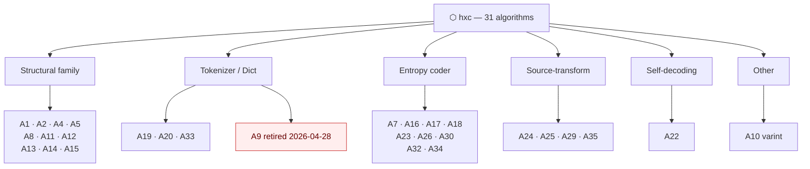

<p align="center">
  
</p>

<h1 align="center">⬡ hxc</h1>

<p align="center"><strong>Hexa-Canonical Format</strong> — a wire/storage format for AI-native pipelines</p>

<p align="center">
  <a href="LICENSE"></a>
  <a href=".github/workflows/lint.yml"></a>
  
  
  
</p>

<p align="center">Line-oriented · byte-canonical · ASCII-stable · KV-cache friendly</p>

---

HXC is what JSON/JSONL looks like when you optimize for *repeated AI context* instead of human eyeballs: schemas declared once, values pipe-separated, same logical content → byte-identical prefix → prefill reuse.

> [!NOTE]
> HXC is **not** a replacement for hexa-lang's `.raw` (SSOT-rule format). HXC is the wire form for *what currently is JSON / JSONL* — ledgers, dispatch envelopes, witness rows. The two are sister formats with disjoint scopes.

## At a glance

```
# schema:s1 ts action balance_usd delta_usd
@s1 "2026-04-22T16:03:14Z"|"session"|"135.842"|"0.0000"
@s1 "2026-04-22T16:10:25Z"|"session"|"135.842"|"0.0000"
@s1 "2026-04-22T17:01:08Z"|"session"|"136.110"|"0.2680"
```

- `# schema:<id> k1 k2 ...` declares a positional schema.
- `@<id> v1|v2|...` is a data row referencing it.
- `~` = null. Object/array values → JSON-compact with sorted keys.
- UTF-8, no BOM, LF only, single trailing `\n`.

See [`examples/`](examples/) for more, [`spec/hxc.md`](spec/hxc.md) for the full v2 spec.

## Why HXC

Honest pilot measurements on representative JSONL/JSON surfaces:

| Surface class | Native → HXC | Saving |
|---|---|---|
| Audit ledger (Class-T, schema-rich) | 48,774 B → 1,595 B | **96.73%** |
| Large JSON registry (Class-J ≥100KB) | 128,229 B → 18,049 B | **85.92%** |
| Atlas witness (Class-M mixed) | 3,002 B → 2,171 B | 27.7% |
| Already-canonical raw text | 6,093 B → 6,078 B | 0.25% (no-op) |

> [!TIP]
> HXC delivers measurable wins **on JSON/JSONL surfaces with schema repetition**. On already-canonical text it is a near-no-op (correct — nothing to compress). On text-heavy prose it is a deliberate carve-out: a byte-level compression algorithm cannot fight Indo-European semantic floor. See [`spec/hxc.md` §Per-class reachability](spec/hxc.md).

## Algorithm catalog

31 deterministic algorithms (A1–A35) — no neural mixers, no LZMA dep, no online learning. Every algorithm is reproducible from input bytes alone.



Full module list → [`algorithms/README.md`](algorithms/README.md).

> [!IMPORTANT]
> All algorithms maintain the `raw 137 cmix-ban` invariant — deterministic predictors only. This makes encoder output reproducible across machines and forbids neural-mixer dependencies that would compromise the format's portability.

## Status

- **v2 live** (2026-04-30) — 31-algorithm catalog, base85 wire encoding, per-class reachability table
- **mk2 dogfooded** (2026-05-02) — `core/hxc_format/` plug-in module with `HXC2` magic, multi-rule indexed
- **v3 planned** — per-class lint gating, unified encoder dispatcher

## License

[CC0-1.0](LICENSE) — public domain. Use freely.

## Repo layout

```
hxc/
├── README.md         this file
├── LICENSE           CC0-1.0
├── spec/
│   └── hxc.md        canonical v2 spec
├── examples/         valid .hxc samples
├── algorithms/       A1–A35 stdlib mirror (34 .hexa modules)
├── tool/             encoder/decoder/lint references
├── docs/
│   ├── INDEX.md      doc index
│   ├── DESIGN.md     README design notes
│   └── logo.svg      hexagon mark
└── .github/workflows/
    └── lint.yml      byte-canonical invariant CI
```
