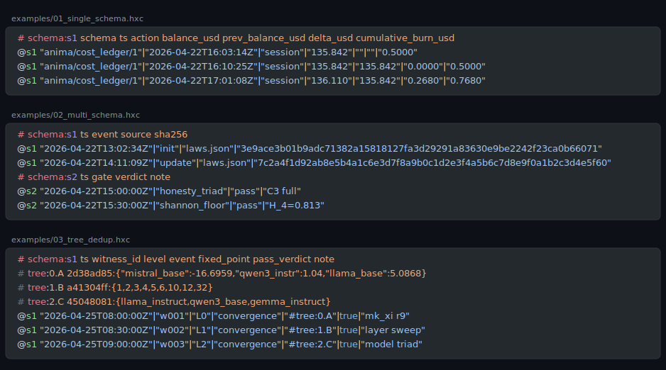
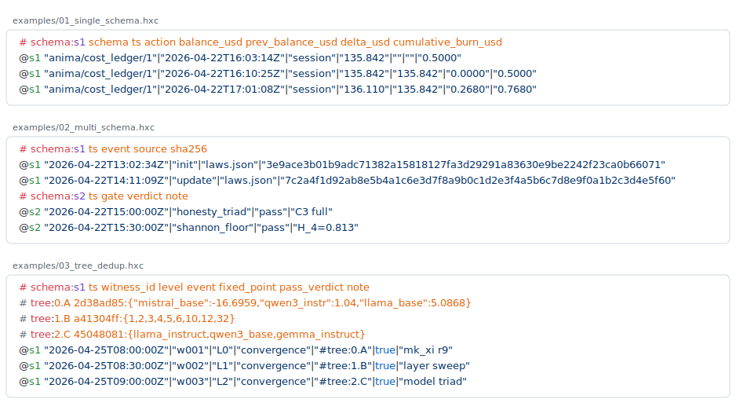

<p align="center">
  
</p>

<h1 align="center">⬡ hxc</h1>

<p align="center"><strong>Hexa-Canonical Format</strong> — a wire/storage format for AI-native pipelines</p>

<p align="center">
  <a href="LICENSE"></a>
  <a href=".github/workflows/lint.yml"></a>
  
  
  
</p>

<p align="center">Line-oriented · byte-canonical · ASCII-stable · KV-cache friendly</p>

---

HXC is what JSON/JSONL looks like when you optimize for *repeated AI context* instead of human eyeballs: schemas declared once, values pipe-separated, same logical content → byte-identical prefix → prefill reuse.

> [!NOTE]
> HXC is **not** a replacement for hexa-lang's `.raw` (SSOT-rule format). HXC is the wire form for *what currently is JSON / JSONL* — ledgers, dispatch envelopes, witness rows. The two are sister formats with disjoint scopes.

## At a glance

```yaml
# HXC sample — yaml fence used for color approximation only;
# `.hxc` is not yet a registered GitHub Linguist language.
# schema:s1 ts action balance_usd delta_usd
@s1 "2026-04-22T16:03:14Z"|"session"|"135.842"|"0.0000"
@s1 "2026-04-22T16:10:25Z"|"session"|"135.842"|"0.0000"
@s1 "2026-04-22T17:01:08Z"|"session"|"136.110"|"0.2680"
```

- `# schema:<id> k1 k2 ...` declares a positional schema.
- `@<id> v1|v2|...` is a data row referencing it.
- `~` = null. Object/array values → JSON-compact with sorted keys.
- UTF-8, no BOM, LF only, single trailing `\n`.

See [`examples/`](examples/) for more, [`spec/hxc.md`](spec/hxc.md) for the full v2 spec.

## Why HXC

Honest pilot measurements on representative JSONL/JSON surfaces:

| Surface class | Native → HXC | Saving |
|---|---|---|
| Audit ledger (Class-T, schema-rich) | 48,774 B → 1,595 B | **96.73%** |
| Large JSON registry (Class-J ≥100KB) | 128,229 B → 18,049 B | **85.92%** |
| Atlas witness (Class-M mixed) | 3,002 B → 2,171 B | 27.7% |
| Already-canonical raw text | 6,093 B → 6,078 B | 0.25% (no-op) |

> [!TIP]
> HXC delivers measurable wins **on JSON/JSONL surfaces with schema repetition**. On already-canonical text it is a near-no-op (correct — nothing to compress). On text-heavy prose it is a deliberate carve-out: a byte-level compression algorithm cannot fight Indo-European semantic floor. See [`spec/hxc.md` §Per-class reachability](spec/hxc.md).

## Algorithm catalog

31 deterministic algorithms (A1–A35) — no neural mixers, no LZMA dep, no online learning. Every algorithm is reproducible from input bytes alone.

Full module list → [`algorithms/README.md`](algorithms/README.md).

> [!IMPORTANT]
> All algorithms maintain the `raw 137 cmix-ban` invariant — deterministic predictors only. This makes encoder output reproducible across machines and forbids neural-mixer dependencies that would compromise the format's portability.

## Status

- **v2 live** (2026-04-30) — 31-algorithm catalog, base85 wire encoding, per-class reachability table
- **mk2 dogfooded** (2026-05-02) — `core/hxc_format/` plug-in module with `HXC2` magic, multi-rule indexed
- **v3 planned** — per-class lint gating, unified encoder dispatcher

## Install

HXC ships as a reference algorithm catalog in [hexa-lang](https://github.com/dancinlab/hexa-fusion) — there is no standalone `hxc` CLI binary yet. The two install paths:

```sh
# 1. Install hexa-lang (gives you `hexa` to run the algorithm modules directly)
/bin/bash -c "$(curl -fsSL https://raw.githubusercontent.com/dancinlab/hexa-lang/main/install.sh)"

# 2. Clone hxc (algorithms + spec + examples)
git clone https://github.com/dancinlab/hxc ~/core/hxc
cd ~/core/hxc
```

Each `algorithms/hxc_a<N>_<name>.hexa` is invoked via `hexa run` — see `## Run` below. The algorithms are mirrored from `hexa-lang/self/stdlib/`, so a hexa-lang install already carries them; the standalone `~/core/hxc/` checkout is the canonical reference + spec + lint CI surface. A unified `hxc` dispatcher CLI is on the v3 roadmap.

## Run

```sh
# every algorithm module exposes the same 4-verb CLI surface
hexa run algorithms/hxc_a4_structural.hexa --selftest
hexa run algorithms/hxc_a4_structural.hexa encode input.jsonl out.hxc
hexa run algorithms/hxc_a4_structural.hexa decode out.hxc roundtrip.jsonl
hexa run algorithms/hxc_a4_structural.hexa measure input.jsonl       # → bytes-in / bytes-out / ratio

# byte-canonical wire — HXC v2 encode/decode (composite chain dispatches to all 31 algorithms)
hexa run algorithms/hxc_composite_chain_v2.hexa encode ledger.jsonl ledger.hxc
hexa run algorithms/hxc_composite_chain_v2.hexa decode ledger.hxc ledger.roundtrip.jsonl
diff -q ledger.jsonl ledger.roundtrip.jsonl                          # byte-identical roundtrip

# KV-cache stability probe — same logical input → byte-identical prefix
hexa run tool/hxc_pre_encoder.hexa --kv-probe ledger.jsonl           # report longest shared prefix vs prior encode

# cross-host ship — base94 wire envelope (ASCII-stable, terminal-safe)
hexa run algorithms/hxc_base94_codec.hexa encode ledger.hxc ledger.hxc.b94
scp ledger.hxc.b94 host2:/tmp/                                       # cross-host transfer
ssh host2 hexa run ~/core/hxc/algorithms/hxc_base94_codec.hexa decode /tmp/ledger.hxc.b94 /tmp/ledger.hxc

# per-class measurement (A4 structural · A16 arithmetic · A20 schema-aware BPE · A33 cross-repo dict)
hexa run algorithms/hxc_a16_arithmetic_coder.hexa measure witness.jsonl
hexa run algorithms/hxc_a20_schema_aware_bpe.hexa  measure registry.json
hexa run algorithms/hxc_a33_cross_repo_dict.hexa   measure corpus/

# entry-point modules for the 31-algorithm catalog (A1–A35; A1/A2/A5 inherent, A9 retired)
hexa run algorithms/hxc_a7_shared_dict.hexa        --selftest
hexa run algorithms/hxc_a17_ppm_order3.hexa        --selftest
hexa run algorithms/hxc_a30_bwt_mtf.hexa           --selftest
hexa run algorithms/hxc_a34_sub_byte_arith.hexa    --selftest
hexa run algorithms/hxc_a35_source_transform.hexa  --selftest

# composite dispatcher + corpus manifest (multi-file federated encode)
hexa run tool/hxc_composite_dispatcher.hexa encode-corpus ~/.wilson/recap/ recap.hxc
hexa run tool/hxc_corpus_manifest.hexa     build ~/.wilson/recap/ manifest.hxc

# lint / canary watcher (CI invariants — byte-canonical + raw-137 cmix-ban)
hexa run tool/hxc_d1_canary_watcher.hexa   ~/core/hxc/examples/
```

See [`algorithms/README.md`](algorithms/README.md) for the full module table grouped by family (structural · tokenizer · entropy · source-transform).

## License

[CC0-1.0](LICENSE) — public domain. Use freely.

## Repo layout

```
hxc/
├── README.md         this file
├── LICENSE           CC0-1.0
├── spec/
│   └── hxc.md        canonical v2 spec
├── examples/         valid .hxc samples
├── algorithms/       A1–A35 stdlib mirror (34 .hexa modules)
├── tool/             encoder/decoder/lint references
├── syntaxes/
│   └── hxc.tmLanguage.json    TextMate grammar (theme-agnostic)
├── docs/
│   ├── INDEX.md      doc index
│   ├── DESIGN.md     README design notes + syntax-highlighting path
│   └── logo.svg      hexagon mark
└── .github/workflows/
    └── lint.yml      byte-canonical invariant CI
```

## Editor support

`.hxc` is not yet a registered language on [github/linguist](https://github.com/github-linguist/linguist), so GitHub does not natively highlight `.hxc` fences. The repo ships a TextMate grammar that any modern editor can load — see [`syntaxes/README.md`](syntaxes/README.md) for VS Code / Sublime / TextMate install steps. Roadmap to upstream registration is in [`docs/DESIGN.md` §6](docs/DESIGN.md).

### Live preview

Both themes rendered with [shiki](https://shiki.style/) from the shipped grammar — same content, different theme.

**github-dark**

<p align="center">
  
</p>

**github-light**

<p align="center">
  
</p>

Browser-only view (combined): [`docs/preview.html`](docs/preview.html). Regenerate via `node scripts/render_svg.mjs` after grammar/example changes — see [`scripts/README.md`](scripts/README.md).
