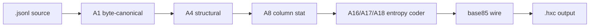

# README design — how format projects decorate

How JSON / YAML / TOML / Protocol Buffers / MessagePack README pages get their visual identity. Reference notes for evolving `hxc`'s presentation.

## 1. Shields.io badges (most common)

The colored rectangular labels at the top of most format-spec READMEs (license, CI, version, downloads). Generated dynamically by `shields.io` — the repo only stores the URL.

```markdown


```

- Preview / pattern catalog: <https://shields.io/>
- Renders as SVG inline; no repo storage needed
- Common slots: license · CI status · spec version · downloads · stars · contributor count

## 2. Logo (SVG asset)

Format identity marks (JSON cube, YAML logo, TOML mark, MessagePack glyph) are **SVG files committed to the repo** and referenced from the README. Authoring options:

- Hand-write `<svg>` for simple geometric marks (a single hexagon is one `<polygon>`)
- Figma / Inkscape / Excalidraw → export as `.svg`
- Place under `docs/logo.svg` or `assets/logo.svg`

```markdown
<p align="center">
  
</p>
```

`hxc`'s ⬡ identity maps cleanly to a single 6-sided polygon — minimal asset suffices.

## 3. GitHub-flavored markdown features

Only render on GitHub (and platforms that emulate GFM):

| Feature | Syntax | Use |
|---|---|---|
| Alerts | `> [!NOTE]` / `[!WARNING]` / `[!TIP]` / `[!IMPORTANT]` / `[!CAUTION]` | Colored callout boxes |
| Mermaid diagrams | ` ```mermaid ` fenced block | flowchart / sequence / state / class — rendered to SVG by GitHub |
| Collapsible sections | `<details><summary>...</summary>...</details>` | Hide long sub-sections behind a click |
| Centered content | `<p align="center">...</p>` | Logo + tagline hero |
| Task lists | `- [x] done` | Roadmap checklists |
| Footnotes | `text[^1]` + `[^1]: note` | Spec citations |

## 4. ASCII headers (universal fallback)

Generated by `figlet` / `toilet` CLI, or web tool <https://patorjk.com/software/taag/>. No external dependency, renders identically on every platform.

```
██╗  ██╗██╗  ██╗ ██████╗
██║  ██║╚██╗██╔╝██╔════╝
███████║ ╚███╔╝ ██║
██╔══██║ ██╔██╗ ██║
██║  ██║██╔╝ ██╗╚██████╗
╚═╝  ╚═╝╚═╝  ╚═╝ ╚═════╝
```

Wrap in a fenced code block so monospace alignment is preserved.

## 5. Build status table (Mermaid example for `hxc`)



## Recommended layering for `hxc`

| Tier | Adds | Effort |
|---|---|---|
| Tier-1 | shields.io badges (3–5: license, CI, spec version) | ~1 min |
| Tier-2 | `docs/logo.svg` hexagon + `<p align="center">` hero | ~10 min |
| Tier-3 | Mermaid pipeline diagram in README + GitHub alerts on spec callouts | ~20 min |
| Tier-4 | Custom ASCII header for `cat README.md` terminal viewers | ~5 min |

Layer additively. Tier-1 alone already lifts visual parity with JSON/YAML/TOML repos.

## Reference: format-project README inspirations

- <https://github.com/toml-lang/toml> — minimalist, badges + table-of-contents heavy
- <https://github.com/yaml/yaml> — logo-centric hero, multi-language implementation list
- <https://github.com/msgpack/msgpack> — language matrix table, sponsor section
- <https://github.com/protocolbuffers/protobuf> — heavy CI matrix, downstream consumer list
- <https://jsonlines.org/> (and its repo) — deliberately sparse, single-page spec

Common thread: **the format itself is the product**, so the README sells (a) what problem it solves, (b) a 5-line example, (c) where the spec lives, (d) implementation list. Visual flourish is secondary.
