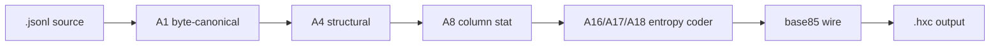

# README design — how format projects decorate

How JSON / YAML / TOML / Protocol Buffers / MessagePack README pages get their visual identity. Reference notes for evolving `hxc`'s presentation.

## 1. Shields.io badges (most common)

The colored rectangular labels at the top of most format-spec READMEs (license, CI, version, downloads). Generated dynamically by `shields.io` — the repo only stores the URL.

```markdown


```

- Preview / pattern catalog: <https://shields.io/>
- Renders as SVG inline; no repo storage needed
- Common slots: license · CI status · spec version · downloads · stars · contributor count

## 2. Logo (SVG asset)

Format identity marks (JSON cube, YAML logo, TOML mark, MessagePack glyph) are **SVG files committed to the repo** and referenced from the README. Authoring options:

- Hand-write `<svg>` for simple geometric marks (a single hexagon is one `<polygon>`)
- Figma / Inkscape / Excalidraw → export as `.svg`
- Place under `docs/logo.svg` or `assets/logo.svg`

```markdown
<p align="center">
  
</p>
```

`hxc`'s ⬡ identity maps cleanly to a single 6-sided polygon — minimal asset suffices.

## 3. GitHub-flavored markdown features

Only render on GitHub (and platforms that emulate GFM):

| Feature | Syntax | Use |
|---|---|---|
| Alerts | `> [!NOTE]` / `[!WARNING]` / `[!TIP]` / `[!IMPORTANT]` / `[!CAUTION]` | Colored callout boxes |
| Mermaid diagrams | ` ```mermaid ` fenced block | flowchart / sequence / state / class — rendered to SVG by GitHub |
| Collapsible sections | `<details><summary>...</summary>...</details>` | Hide long sub-sections behind a click |
| Centered content | `<p align="center">...</p>` | Logo + tagline hero |
| Task lists | `- [x] done` | Roadmap checklists |
| Footnotes | `text[^1]` + `[^1]: note` | Spec citations |

## 4. ASCII headers (universal fallback)

Generated by `figlet` / `toilet` CLI, or web tool <https://patorjk.com/software/taag/>. No external dependency, renders identically on every platform.

```
██╗  ██╗██╗  ██╗ ██████╗
██║  ██║╚██╗██╔╝██╔════╝
███████║ ╚███╔╝ ██║
██╔══██║ ██╔██╗ ██║
██║  ██║██╔╝ ██╗╚██████╗
╚═╝  ╚═╝╚═╝  ╚═╝ ╚═════╝
```

Wrap in a fenced code block so monospace alignment is preserved.

## 5. Build status table (Mermaid example for `hxc`)



## Recommended layering for `hxc`

| Tier | Adds | Effort |
|---|---|---|
| Tier-1 | shields.io badges (3–5: license, CI, spec version) | ~1 min |
| Tier-2 | `docs/logo.svg` hexagon + `<p align="center">` hero | ~10 min |
| Tier-3 | Mermaid pipeline diagram in README + GitHub alerts on spec callouts | ~20 min |
| Tier-4 | Custom ASCII header for `cat README.md` terminal viewers | ~5 min |

Layer additively. Tier-1 alone already lifts visual parity with JSON/YAML/TOML repos.

## Reference: format-project README inspirations

- <https://github.com/toml-lang/toml> — minimalist, badges + table-of-contents heavy
- <https://github.com/yaml/yaml> — logo-centric hero, multi-language implementation list
- <https://github.com/msgpack/msgpack> — language matrix table, sponsor section
- <https://github.com/protocolbuffers/protobuf> — heavy CI matrix, downstream consumer list
- <https://jsonlines.org/> (and its repo) — deliberately sparse, single-page spec

Common thread: **the format itself is the product**, so the README sells (a) what problem it solves, (b) a 5-line example, (c) where the spec lives, (d) implementation list. Visual flourish is secondary.

## 6. Syntax highlighting for `.hxc` (GitHub Linguist + TextMate)

GitHub renders code-fence syntax highlighting through two layers:

1. **`github/linguist`** ([github.com/github-linguist/linguist](https://github.com/github-linguist/linguist)) — maps file extension → language identity + assigns the language-pie-chart color
2. **TextMate grammar** (`.tmLanguage.json`) — defines the regex token rules (which spans become string, which become comment, etc.)

A new extension like `.hxc` does not get highlighting in ` ```hxc ` fences until both are in place upstream.

### Long-term: official linguist registration

1. Fork [`github-linguist/linguist`](https://github.com/github-linguist/linguist)
2. Add entry to `lib/linguist/languages.yml`:
   ```yaml
   HXC:
     type: data
     color: "#0969da"
     extensions:
       - ".hxc"
     ace_mode: text
     tm_scope: source.hxc
     language_id: <assigned by reviewers>
   ```
3. Add a TextMate grammar submodule under `vendor/grammars/` (typically a separate repo, e.g. `hxc-syntax`)
4. Add sample files under `samples/HXC/` for detection tests
5. Submit PR

> [!IMPORTANT]
> Linguist's CONTRIBUTING bar is strict — "language must be in active use, ~200+ unique public repos." A brand-new format will be rejected until adoption catches up. Path: ship grammar + VS Code extension → wait for adoption → then PR linguist.

### Short-term workarounds

| Option | Effect | Effort |
|---|---|---|
| `.gitattributes` linguist override | Within one repo: classify `*.hxc` as another language for the pie chart. Does not affect code fences | 1 line |
| TextMate grammar file in repo | Authors get highlighting in VS Code / Sublime / TextMate / Atom. No GitHub effect | 1–2 hours |
| VS Code extension on marketplace | Users `code --install-extension` → instant editor highlighting | +30 min |
| Code-fence alias in markdown | Use ` ```yaml ` or ` ```ini ` with a comment marker. Borrowed colors but readable | 0 min |

ROI order: grammar file → VS Code extension → (adoption grows) → linguist PR.

### TextMate grammar draft for `.hxc`

The HXC token surface is small enough for a compact grammar:

```jsonc
{
  "scopeName": "source.hxc",
  "patterns": [
    { "name": "comment.line.schema.hxc",
      "match": "^# schema:\\S+.*$" },
    { "name": "comment.line.directive.hxc",
      "match": "^# (tree|delta|const|col-prefix|row-prefix|subschema|arith|ppm|a18|ints|hxc-shared-dict):.*$" },
    { "name": "comment.line.hxc",
      "match": "^#.*$" },
    { "name": "meta.row.hxc",
      "begin": "^(@\\S+) ",
      "beginCaptures": { "1": { "name": "entity.name.tag.hxc" } },
      "end": "$",
      "patterns": [
        { "name": "string.quoted.double.hxc",
          "match": "\"([^\"\\\\]|\\\\.)*\"" },
        { "name": "constant.language.null.hxc", "match": "~" },
        { "name": "constant.language.bool.hxc", "match": "\\b(true|false)\\b" },
        { "name": "constant.numeric.hxc", "match": "-?\\d+(\\.\\d+)?" },
        { "name": "punctuation.separator.hxc", "match": "\\|" }
      ]
    }
  ]
}
```

Color mapping is delegated to the user's theme — every scope used above (`entity.name.tag`, `string.quoted`, `comment.line`, `constant.language`, `punctuation.separator`) is a standard TextMate scope, so the grammar works with every published theme without per-theme tuning.

### VS Code extension layout (publish-ready)

```
vscode-hxc/
├── package.json                 (extension manifest)
├── language-configuration.json  (comment toggle, brackets)
├── syntaxes/
│   └── hxc.tmLanguage.json      (the grammar above)
├── README.md
├── LICENSE                       (CC0-1.0)
└── .vscodeignore
```

Publishing requires an Azure DevOps PAT and `vsce publish` — owner-only step. Code itself ships freely under CC0-1.0.

### Recommended sequence for `hxc`

1. Land `vscode-hxc` repo (grammar + extension scaffold) — gives early adopters real highlighting in editors
2. Publish to marketplace once API contract feels stable
3. Track adoption via GitHub code-search for `language:hxc` hits and marketplace install count
4. File `github/linguist` PR once adoption clears their threshold
5. Until then, README code blocks in this repo can use plain text fences — no need to fake a language
